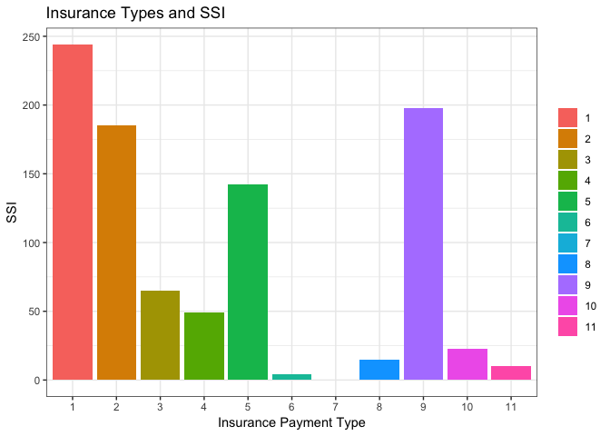
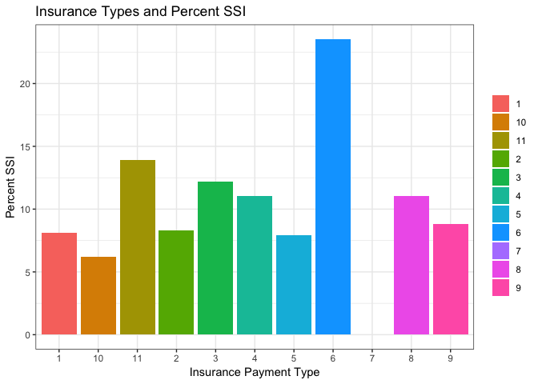

Justin Sub-analysis
================
Justin Hsie
11/30/2018

How are successes distributed by insurance status?
--------------------------------------------------

For this sub-analysis we wanted to see how colectomy successes were correlated with insurance staus. We chose to measure success with the number of SSIs, involving the variables postop\_ssi\_super, postop\_ssi\_deep, and postop\_ssi\_organspace.

#### Setup

``` r
library(tidyverse)
library(haven)
```

#### Clean data

``` r
colectomies = read_dta("colectomy_raw_new.dta")
```

Here we cleaned the data set and combined the different SSIs to just indicate whether the patient had any SSIs or not.

``` r
is_mostly_intact = function(col) {
  # Account for literal NAs and blanks
  missings = is.na(col) | col == "" | col == "NA"
  return(sum(missings) <= (3084 / 2))
}

tidy_colectomies = colectomies %>% 
  select(-starts_with("flg_"), -starts_with("e_")) %>% 
  select_if(unlist(map(., is_mostly_intact), use.names = FALSE)) %>% 
  mutate(any_ssi =  (postop_ssi_super + postop_ssi_deep +   postop_ssi_organspace) > 1)
```

#### Insurance Types and SSI

``` r
insurance_df = 
  select(tidy_colectomies, any_ssi, postop_ssi_super,
                      postop_ssi_deep, postop_ssi_organspace,
                      insurance_payment_type) %>% 
  mutate(all_ssi = 
           postop_ssi_super + postop_ssi_deep + postop_ssi_organspace, 
         ssi = ifelse(all_ssi != 0, 1, 0),
         insurance_payment_type = as.factor(insurance_payment_type)) %>% 
  drop_na()
```

#### Insurance Types and SSI Plot

``` r
ggplot(data = insurance_df,
                        aes(x = insurance_payment_type,
                            y = ssi,
                            fill = insurance_payment_type)) +
  geom_bar(stat = "identity") +
  theme_bw() +
  labs(
    x = "Insurance Payment Type",
    y = "SSI",
    title = "Insurance Types and SSI",
    fill = ""
  ) 
```



#### Insurance Types and Percent SSI

``` r
insurance_total = insurance_df %>% 
   mutate(insurance_payment_type = as.numeric(insurance_payment_type)) %>%
   count(insurance_payment_type)
```

``` r
total_ssi = insurance_df %>% 
   select(insurance_payment_type, ssi) %>% 
   group_by(insurance_payment_type, ssi) %>% 
   mutate(count = n()) %>% 
   filter(ssi != 0) %>% 
   summarise_all(funs(max))
```

``` r
percent = tribble(
  ~insurance, ~ssi, ~total,
  "1", 244, 3007,
  "2", 185, 2229,
  "3", 65, 533,
  "4", 49, 444,
  "5", 142, 1791,
  "6", 4, 17,
  "7", 0, 2,
  "8", 15, 136,
  "9", 198, 2252,
  "10", 23, 372,
  "11", 10, 72
)
```

#### Insurance Types and Percent SSI Plot

``` r
ggplot(data = percent, 
       aes(x = insurance,
           y = ssi / total * 100,
           fill = insurance)) +
  geom_bar(stat = "identity") +
  theme_bw() +
  labs(
    x = "Insurance Payment Type",
    y = "Percent SSI",
    title = "Insurance Types and Percent SSI",
    fill = ""
  ) 
```



In these plots, the insurance payment types are as follows:
1. Medicare
2. Medicare + Medicare Supplemental Plan/Medigap Insurance
3. Medicaid
4. Medicare AND Medicaid
5. Blue Cross Blue Shield of Michigan (BCBSM)
6. Private Insurance, incl. HMO plans
7. Other
8. Self-Pay
9. Uninsured
10. International Patient
11. Medicare Advantage - Blue Cross Blue Shield of Michigan (BCBSM)

In the first plot, we can see that the most occurences of SSIs are in patients with Medicare, Medicare + Medicare Supplemental Plan/Medigap Insurance, or those who are uninsured. However, those variables also had the greatest number of patients, so we can't solely rely on the straight count of SSI occurences to tell us anything.

In the second plot, we can see the percentage of SSI occurences out of the total number of colectomies performed based on insurance type. Here, we can see that there is generally no distinction between the insurance types, with most of the percentages hovering between 6 to 12 percent. Noticeably, patients with private insurance had a much higher percentage of SSIs at above 25 percent while patients with other insurance had 0 percent. However, this is most likely due to the small sample size of patients with those types of insurance and should not affect our conclusions.

In the end it seems that there is not much correlation between insurance type and occurence of SSIs, with the occurences of SSIs pretty even across all insurance types.
