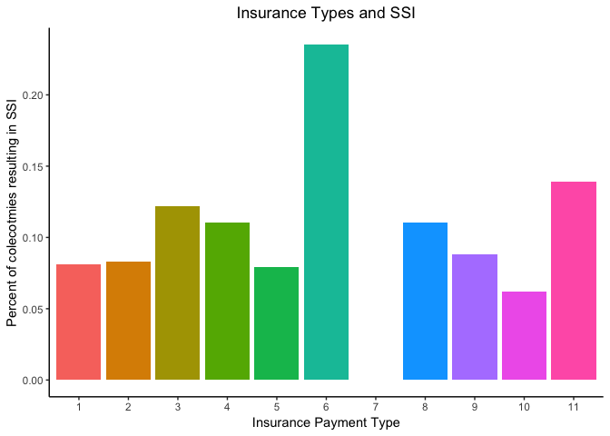
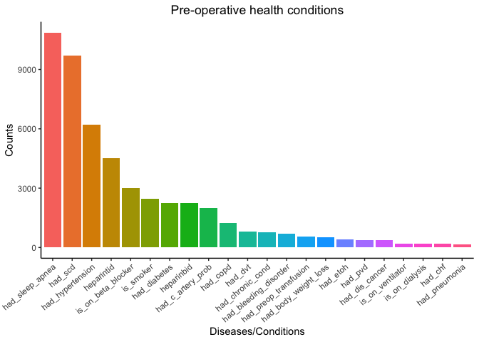
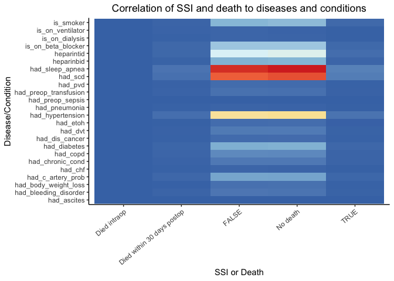
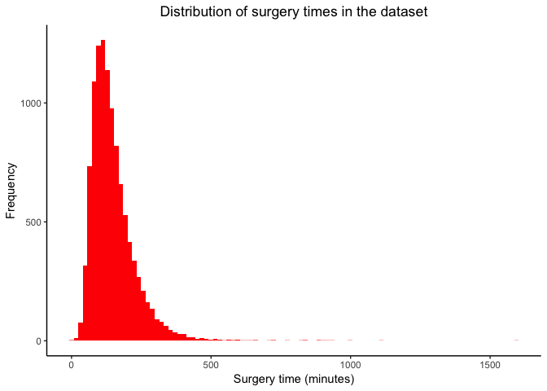
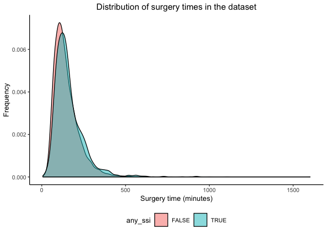

What's in a colectomy? An Analysis
================


Table of Contents
=================

-   <a href="#intro">Introduction</a>
-   <a href="#characterize">Data Characterization</a>
-   <a href="#tidying">Tidying The Data</a>
-   <a href="#lit">Literature Review</a>
-   <a href="#sub">Subanalyses</a>
-   <a href="#regress">Regression Analysis</a>
-   <a href="#conclusion">Discussion</a>
-   <a href="#changes">Changes Mid-Report</a>
-   <a href="#refs">References</a>

------------------------------------------------------------------------

### Authors

-   Christian Pascual (UNI: cbp2128)
-   Justin Hsie (UNI: jih2119)
-   Tiffany Tu (UNI: tt2714)
-   Xiao Shi (UNI: xs:2330)

<h1 id="intro">
Introduction
</h1>
Colectomies are surgical procedures that remove all of part of your large intestine. These surgeries are performed for various reasons, ranging from bowel obstruction to colon cancer. Over 250,000 colectomies are performed each year in the United States alone, representing an estimated 10% of the total volume of general surgeries. Given the prolific nature of the surgery, the rate of post-operation complication is astounding: the average rate of complication approached 30% in the last 10 years. <sup><a href ="https://www.medscape.org/viewarticle/711126">1</a></sup>

Project Motivation
------------------

For our project, we want to investigate what factors contribute to increasing or decreasing the risk of post-operative complication using a dataset on colectomies performed from 2014 - 2016 from multiple hospitals in Michigan. Using this data, we will perform a regression analysis to figure out which variables have an impact on post-surgery complication.

This analysis was inspired by the analyses done for Homework 6. Up until that point, our studies have only ever focused on simple and multiple linear regression, so being able to wield another tool was exciting. With the binary nature of complication, we thought we could apply the same analyses to investigating colectomy factors.

Project Roadmap
---------------

We needed to figure out if prior research has been done for this question. If risk factors have already been established, then they theoretically should truly contribute to our regression. Next, we figured out what our outcome could be since "complication" after a surgery can be defined in so many ways. After a proper literature review, we had a list of candidate factors for the regression. Before applying the regression, we specifically looked at some of these factors to see if there was an association with colectomy complications. Finally, with all this preparation, we entered these variables into an automatic procedure to get our model.

While we did a literature review to choose our covariates, we felt it would be interesting if we could enable others to create a modelling application to recreate what we did. This application would enable interested users to use a subset of the data to create their own models. They may choose any variables they might find useful or that we may have not considered in our model.

<h1 id="characterize">
Data Characterization
</h1>
In addition to `tidyverse`, we created a set of helper functions and variables that we've stored in `utils.R` to save coding space. Our data will initially be stored in the `colectomies` variable.

``` r
library(tidyverse)
library(haven)
source("./utils.R")

# Formatting plot output
knitr::opts_chunk$set(
  out.width = "90%"
)

# Set the plot design
theme_set(theme_classic() + 
            theme(legend.position = "bottom", 
                  legend.key.size = unit(1.5, "line"),
                  plot.title = element_text(hjust = 0.5)))

# Raw data
colectomies = read_dta(file = './data/colectomy_raw_new.dta') 
```

In its raw form, the data has 10868 rows and 992 columns. Each row corresponds to a single colectomy and an incredible amount of information, including a bevy of laboratory, disease, surgery and patient data.

A copy of the data is contained [here](https://drive.google.com/open?id=1-cOf82Q-KgXazfYxN-3PjgYA2oSBKriZ) in a Google Drive.

Despite the seemingly sheer size of the data, it has its limitations. A brief glance at the data showed us that many of the columns are useless for our analysis; many columns contain mostly or only missing data. Before we can start variable selection for our model, we need to tidy up the dataset.

<h1 id="tidying">
Tidying the Data
</h1>

Data Reduction & Cleaning
-------------------------

To start the cleaning, we want to remove all columns that contain more than 50% missing values (either blank cells or `NA`). We chose 50% since we've seen this cutoff used in other regression studies. Further adding to the clutter, some columns actually contain duplicate information from others. We found that these duplicate columns always start with `flg` or `e`.

``` r
tidy_colectomies = colectomies %>% 
  select(-starts_with("flg_"), -starts_with("e_")) %>% 
  select_if(unlist(map(., is_mostly_intact), use.names = FALSE)) %>% 
  prettify_names(.) 
```

Our function, `is_mostly_intact`, helps us identify columns that are more than 50% missing or blank. `prettify_names` helps us mass-change the column names in the dataset in a succinct way, leaving variables that are more informative to code with. After this purge, our reduced dataset now stands at 10868 rows and 233 columns.

Data Cleaning
-------------

Many of the columns in the data appear to be numerical, but are in fact, categorical. We performed the retyping with our `catfactory` function in `utils.R`.

``` r
tidy_colectomies = tidy_colectomies %>%
  catfactory(.) %>% 
  mutate(any_ssi = (postop_ssi_super + postop_ssi_deep + postop_ssi_organspace) >= 1)
```

The outcome of interest we will focus on is surgical site infection (SSI). After researching more into colectomies, we found that infection was the one of the most common types of complication. We considered mortality in the beginning, but given its rarity, we decided to drop it. We believe that focusing on this aspect of post-operation will allow us to narrow down the scope of our analysis while allowing for the greatest breadth of "complication".

Surgical site infection (SSI) is contained in 3 particular columns (`postop_ssi_super`, `postop_ssi_deep` and `postop_ssi_organspace`) in the dataset, which we compile into one summary variable: `any_ssi`.

Despite the heavy data reduction, too many variables remain to know to just toss into a stepwise regression. We performed a literature review to see what relationships have been established.

<h1 id="lit">
Literature Review: Relevant Factors
</h1>
Thankfully, several factors have been identified as risk factors for complications in colorectal surgery. Kirchoff established many risk factors in a 2010 paper on the subject. The paper found that age, gender, prior surgery, obesity, nutritional status and body weight loss were patient-related factors. Factors that were related to the surgery itself included: open access to abdominal cavity, blood loss, surgical approach switches and length of operating time. <sup><a href="https://www.ncbi.nlm.nih.gov/pubmed/27765178">2</a></sup>

Ko et. al found that certain diseases were associated with increased risk of death post-colectomy, including venous thromboembolism (VTE), sepsis, acute myocardial infarction, pneumonia, respiratory failure and shock. <sup>[3](https://www.ncbi.nlm.nih.gov/pubmed/27765178)</sup>

In another paper, Tang et. al focused on risk factors associated with surgical site infection, our outcome of interest. Dr. Tang identified ASA score, blood transfusion, drainage use, and sex. <sup>[4](https://www.ncbi.nlm.nih.gov/pmc/articles/PMC1422004)</sup>

With these papers in mind, we know it would be best to include these variables. We selected a few of these variables to visualize their relationship with SSI in the cleaned dataset.

<h1 id="sub">
Subanalyses
</h1>

### Is there a relationship between SSI and insurance status?

One variable we thought would have a relationship to SSI was insurance status. We believed that patients with little to no coverage would be forced to go to less experienced hospitals and experience more SSI. To confirm or deny this belief, we looked at how SSIs were distributed by insurance staus.

``` r
insurance_df = tidy_colectomies %>% 
  select(., any_ssi, insurance_payment_type) %>% 
  mutate(insurance_payment_type = as.factor(insurance_payment_type)) %>% 
  filter(!is.na(insurance_payment_type)) %>% 
  group_by(insurance_payment_type) %>% 
  summarize(n = n(),
            total_SSI = sum(any_ssi),
            percent_SSI = 100 * (total_SSI / n)) %>% 
  mutate(insurance_payment_type = recode(insurance_payment_type, 
                                         `1` = "Medicare", 
                                         `2` = "Medicare + Medicare Supplemental Plan/Medigap Insurance", 
                        `3` = "Medicaid", `4` = "Medicare AND Medicaid", 
                        `5` = "Blue Cross Blue Shield of Michigan (BCBSM)", 
                        `6` = "Private Insurance, incl. HMO plans", 
                        `7` = "Other", `8` = "Self-Pay", 
                        `9` = "Uninsured", `10` = "International Patient", 
                        `11` = "Medicare Advantage Blue Cross Blue Shield of Michigan"))

knitr::kable(insurance_df)
```

| insurance\_payment\_type                                |     n|  total\_SSI|  percent\_SSI|
|:--------------------------------------------------------|-----:|-----------:|-------------:|
| Medicare                                                |  3007|         244|      8.114400|
| Medicare + Medicare Supplemental Plan/Medigap Insurance |  2229|         185|      8.299686|
| Medicaid                                                |   533|          65|     12.195122|
| Medicare AND Medicaid                                   |   444|          49|     11.036036|
| Blue Cross Blue Shield of Michigan (BCBSM)              |  1791|         142|      7.928532|
| Private Insurance, incl. HMO plans                      |    17|           4|     23.529412|
| Other                                                   |     2|           0|      0.000000|
| Self-Pay                                                |   136|          15|     11.029412|
| Uninsured                                               |  2252|         198|      8.792185|
| International Patient                                   |   372|          23|      6.182796|
| Medicare Advantage Blue Cross Blue Shield of Michigan   |    72|          10|     13.888889|

In the first table, we can see that most SSIs are in patients with Medicare, Medicare + Medicare Supplemental Plan/Medigap Insurance, or the uninsured. However, these groups also represent the greatest number of patients, so we can't solely rely on the absolute SSI counts to tell us anything useful. We must look at the percentages instead.

``` r
plotinsurance_df = insurance_df %>% 
  mutate(insurance_payment_type = recode(insurance_payment_type,
                                         `Medicare + Medicare Supplemental Plan/Medigap Insurance` = "Medicare + \nMedicare Supplemental Plan \n/Medigap Insurance", 
                        `Blue Cross Blue Shield of Michigan (BCBSM)` = "Blue Cross Blue Shield \nof Michigan (BCBSM)", 
                        `Private Insurance, incl. HMO plans` = "Private Insurance, \nincl. HMO plans", 
                        `Medicare Advantage Blue Cross Blue Shield of Michigan` = "Medicare Advantage \n Blue Cross Blue Shield of Michigan"))

ggplot(data = plotinsurance_df,
       aes(x = insurance_payment_type,
           y = percent_SSI,
           fill = insurance_payment_type)) +
  geom_bar(stat = "identity") +
  labs(
    x = "Insurance Payment Type",
    y = "Percent of colecotmies resulting in SSI",
    title = "Insurance Types and SSI"
  ) + 
  theme(legend.position = "none", 
        axis.text.x = element_text(angle = 50, hjust = 1))
```



In the second plot, we can see the percentage of SSI occurences out of the total number of colectomies performed based on insurance type. There is generally no distinction between the insurance types, with most of the percentages hovering between 6 to 12 percent. Noticeably, patients with private insurance had a much higher percentage of SSIs at above 25 percent while patients with other insurance had 0 percent. However, this is most likely an artifact of the small sample size of this type of insurance.

In the end, our hypotheses was incorrect; there was seemingly no relationship between insurance type and occurence of SSIs. This result indicates it may be a poor candidate for predicting SSI.

### How are SSI distributed in patients with different diseases and prior conditions?

The Ko paper names multiple diseases that are associated with increased risk of SSI. Our dataset contains information on many of these diseases, so we wanted to investigate if our data supports any of Ko's findings. The following list corresponds to data we have that's also in the Ko paper. We've also included other conditions to see for any more potential associations.

-   Smoker: Tobacco use within 1 year
-   EtOH: &gt;2 drinks/day two weeks prior to surgery
-   Body Weight Loss: 10% of body weight loss 6 months prior to surgery
-   CHF: Congestive Heart Failure within 30 days prior to surgery
-   SCD : Specific Carbohydrate Diet
-   COPD: Chronic Obstructive Pulmonary Disease
-   DVT: Deep Vein Thrombosis
-   Chronic Condition: steroids, immunosuppresive medicines
-   Preop-transfusion: received red blood cells within 72 hours of surgery
-   Ventilator: ventilator dependent

``` r
dist_data = healthdisease %>% 
  select(-any_ssi, -death_status) %>% 
  gather(condition, key) %>% 
  filter(key > 0) %>% 
  group_by(condition) %>% 
  summarize(cases = n()) %>% 
  mutate(condition = reorder(condition, -cases))

ggplot(dist_data, aes(x = condition, y = cases, fill = condition)) +
  geom_bar(stat = "identity") + 
  labs(
    title = "Pre-operative health conditions",
    x = "Diseases/Conditions",
    y = "Counts"
  ) +
  theme(axis.text.x = element_text(angle = 40, hjust = 1), 
        legend.position = "none") 
```



We can see in the dataset that many of these conditions/diseases are relatively rare in the dataset. This may impact their significance in the regression, but we've established that there are patients with these characteristics.

#### SSI and death association to each health condition

To see how often a condition is related to SSI, we use a heatmap to look for any particularly high rates of association. We also looked at death as an outcome to see if any of these diseases are associated with it.

``` r
heatplot = healthdisease %>% 
  mutate(death_status = recode(death_status, `3` = "No death", `1` = "Died intraop", 
                        `2` = "Died within 30 days postop"), 
         any_ssi = as.character(any_ssi),
         any_ssi = recode(any_ssi, `TRUE` = "SSI", `FALSE` = "No SSI")) %>%
  na.omit() %>% 
  gather(condition, score, -death_status, -any_ssi) %>%
  gather(key, status, -condition, -score) %>% 
  select(-key) %>% group_by(status, condition) %>% 
  summarise(score = sum(score))

ggplot(data = heatplot, aes(x = status, y = condition, fill = score)) + 
  geom_tile() + 
  scale_fill_distiller(palette = "RdYlBu") +
  theme(axis.text.x = element_text(angle = 40, hjust = 1)) +
  labs(
    title = "Correlation of SSI and death to diseases and conditions",
    x = "SSI or Death",
    y = "Disease/Condition"
  )
```



Comparing number of death and SSI cases side by side with each health condition, we see a nearly symmetric heatmap. There are fewer cases under patients that actually got SSI or died from the operation, so it is difficult to conclude any direct relationship between health condition and surgery outcome. Intrestingly, we can see that there are a great number of successful cases for patients with sleep apnea, specific carbohydrate diet, and hypertension related ot SSI.

### How is surgical time distributed across the dataset?

Tang pointed out that SSI is associated with long surgery times. This makes sense since patients are more likely to get infected the longer they're under the knife. We'll look at the distribution of surgery times in the dataset to see if there's any outliers.

``` r
tidy_colectomies %>% 
  select(val_surgtime) %>% 
  ggplot(data = ., aes(x = val_surgtime)) + 
  geom_histogram(bins = 100, fill = "red") +
  labs(
    title = "Distribution of surgery times in the dataset",
    x = "Surgery time (minutes)",
    y = "Frequency"
  )
```



Most of the surgeries last around 250 minutes, but we can see that there is a heavy tail on the right. We've included all cases here, so next we'll split up the colectomies that result in SSI and those that don't and compare their distribution.

``` r
tidy_colectomies %>% 
  select(val_surgtime, any_ssi) %>% 
  ggplot(data = ., aes(x = val_surgtime, fill = any_ssi)) + 
  geom_density(bins = 100, alpha = 0.5) +
  labs(
    title = "Distribution of surgery times in the dataset",
    x = "Surgery time (minutes)",
    y = "Frequency"
  )
```

    ## Warning: Ignoring unknown parameters: bins



Although there are some SSI-related surgeries that look to take longer than non-SSI colectomies, both follow a similar distribution. Thus, we cannot definitively say that the surgery time can help differentiate between SSI cases and non-SSI cases based on the plot.

Our subanalyses demonstrate that many of the factors we found in the literature review are seemingly not associated with SSI. We believe that this may be due to differences in types of infection in our dataset and those studied in the papers. In light of our subanalyses, we will still include them in the regression analysis.

<h1 id="regress">
Regression Analysis
</h1>

With our literature review and personal exploration of the data, we have a set of variables to use for our logistic regression. After much debate we decided to analyze a subset of 20 variables. These candidate variables have been shown to be associated with SSI, so we'll use automatic procedures to further cut down on covariates and attempt to get to a more robust, parsimonious model.

``` r
# Selection of 20 candidate covariates for logistic regression
model_covariates = tidy_colectomies %>% 
  select(any_ssi, surgical_approach, had_etoh,
         had_hypertension, had_diabetes, surgical_wound_closure, 
         asa_class_id, is_smoker, bmi, age, sex, had_body_weight_loss,
         had_dvt, had_open_wound, had_pneumonia, had_preop_sepsis,
         had_preop_transfusion, had_epidural, admit_to_icu_postsurg, 
         val_surgtime, length_of_stay) %>% 
  na.omit(.)

just_covariates = model_covariates %>% select(-any_ssi) %>% colnames(.)

# Compactly create the full logistic model
full_fmla = as.formula(
  paste("any_ssi ~", paste(c(just_covariates), collapse = "+"))
)

# Models to help guide the automatic procedures
null = glm(any_ssi ~ 1, data = model_covariates, family = binomial())
full = glm(full_fmla, data = model_covariates, family = binomial())

# Stepwise regression to select best subset
step.model = step(null, direction = 'both', scope = list(upper = full))
```

``` r
summary(step.model)
```

    ## 
    ## Call:
    ## glm(formula = any_ssi ~ length_of_stay + surgical_approach + 
    ##     age + asa_class_id + admit_to_icu_postsurg + val_surgtime + 
    ##     surgical_wound_closure + bmi + is_smoker + had_pneumonia + 
    ##     had_dvt, family = binomial(), data = model_covariates)
    ## 
    ## Deviance Residuals: 
    ##     Min       1Q   Median       3Q      Max  
    ## -2.0117  -0.4377  -0.3454  -0.2717   2.8284  
    ## 
    ## Coefficients:
    ##                           Estimate Std. Error z value Pr(>|z|)    
    ## (Intercept)             -3.432e+00  5.016e-01  -6.842 7.83e-12 ***
    ## length_of_stay           6.615e-02  4.308e-03  15.355  < 2e-16 ***
    ## surgical_approach2      -5.464e-01  1.285e-01  -4.252 2.12e-05 ***
    ## surgical_approach3      -4.785e-01  1.507e-01  -3.175  0.00150 ** 
    ## surgical_approach4       2.826e-01  1.199e-01   2.357  0.01841 *  
    ## surgical_approach5      -3.206e-01  2.038e-01  -1.573  0.11572    
    ## surgical_approach6      -4.147e-02  4.814e-01  -0.086  0.93135    
    ## surgical_approach7      -6.280e-01  7.233e-01  -0.868  0.38530    
    ## surgical_approach13     -1.261e+01  6.691e+02  -0.019  0.98496    
    ## age                     -1.398e-02  2.797e-03  -4.999 5.76e-07 ***
    ## asa_class_id2            6.548e-01  4.668e-01   1.403  0.16070    
    ## asa_class_id3            8.157e-01  4.690e-01   1.739  0.08197 .  
    ## asa_class_id4            2.945e-01  4.829e-01   0.610  0.54200    
    ## asa_class_id5           -1.461e-01  6.596e-01  -0.221  0.82476    
    ## asa_class_id7           -1.225e+01  5.330e+02  -0.023  0.98166    
    ## admit_to_icu_postsurg    4.014e-01  8.330e-02   4.819 1.45e-06 ***
    ## val_surgtime             1.090e-03  4.185e-04   2.605  0.00918 ** 
    ## surgical_wound_closure2 -3.722e-01  1.738e-01  -2.142  0.03222 *  
    ## surgical_wound_closure3 -4.256e-02  2.610e-01  -0.163  0.87044    
    ## surgical_wound_closure4 -1.327e+01  2.491e+02  -0.053  0.95751    
    ## bmi                      1.277e-02  4.850e-03   2.633  0.00846 ** 
    ## is_smoker                1.633e-01  8.742e-02   1.868  0.06173 .  
    ## had_pneumoniaTRUE       -4.407e-01  3.122e-01  -1.412  0.15800    
    ## had_dvtTRUE             -2.011e-01  1.410e-01  -1.427  0.15372    
    ## ---
    ## Signif. codes:  0 '***' 0.001 '**' 0.01 '*' 0.05 '.' 0.1 ' ' 1
    ## 
    ## (Dispersion parameter for binomial family taken to be 1)
    ## 
    ##     Null deviance: 5866.1  on 9960  degrees of freedom
    ## Residual deviance: 5327.7  on 9937  degrees of freedom
    ## AIC: 5375.7
    ## 
    ## Number of Fisher Scoring iterations: 14

The resulting stepwise regression results in a model with 23 covariates, with many of them stemming from categorical factors chosen. Out of these covariates, `length_of_stay`, `surgical_approaches` 2, 3 and 4, age, ASA level 3, admission to ICU, surgery time, and BMI remained statistically significant.

<h1 id="conclusion">
Discussion
</h1>

We are pleased to see that many of the variables that we found during our literature found themselves in the model and were statistically significant. However, many of the variables that were found to be risk factors in SSI did not end up in the final model or were not statistically significant. Given the large amount of covariates and categorical variables we had to consider, it is highly likely that many elements that would have been included in a more parsimonious model were excluded thanks to the noise introduced by starting with 20 candidates.

Looking at the model coefficients, we can comment on how each factor affects the odds of SSI. High BMI, admission to the ICU, ASA class 3, being a smoker and long surgery times have positive coefficients, meaning that the odds of SSI in patients with these characteristics are higher than those without. Older patients, length of stay and surgical approaches 2 and 3 correspond with negative coefficients, indicating that odds of SSI are reduced in patients with these qualities.

Although far from perfect, our model gives us some insight into what pre-surgical disease/traits contribute to SSI and supports some of the research done on this particular subject. We believe that our results can be improved by starting with more parsimonious models and building the stepwise regression from there.

We believe this analysis could be improved by focusing on particular subsets of patients who contract infections. We know that colectomies are performed for many different conditions, so different diseases may contribute differently to how patients may be infected.

<h1 id="changes">
Changes Mid-Report
</h1>

During the course of the project, we were unsure whether we should use SSI or death as an outcome. As we started wrangling with the data and reviewing the literature, we realized that more research has been done on SSI. Furthermore, we also found out that death due to colectomy was a rare outcome. These two factors led us to focus on SSI in the subanalyses and regression.

One particularly contentious issue for our project was actually our Shiny application. Given that we had data from multiple hospitals in Michigan, we wanted to create a tool to recommend hospitals to patients given some location data. However, we quickly ran into a roadblock: there was no location information in our dataset. Since we were doing a regression analysis, we decided to opt for a more educational tool instead. Now our Shiny app just allows a user to create their own regression tool and see what the results are.

<h1 id="refs">
References
</h1>

1. Wikipedia: ASA physical status classification system
2. http://www.webmd.com/digestive-disorders/partial-colectomy-for-diverticular-disease
3. http://www.hopkinsmedicine.org/healthlibrary/conditions/surgical_care/surgical_site_infections_134,144/
4. https://www.medscape.org/viewarticle/711126
5. https://www.ncbi.nlm.nih.gov/pmc/articles/PMC2852382
6. https://www.ncbi.nlm.nih.gov/pubmed/27765178
7. https://www.ncbi.nlm.nih.gov/pmc/articles/PMC1422004
