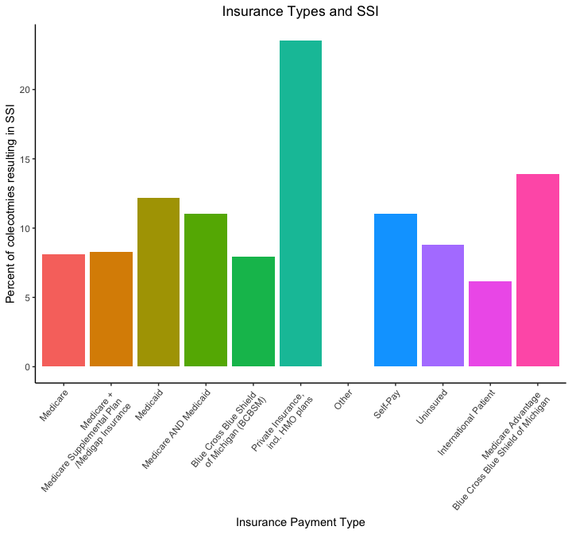
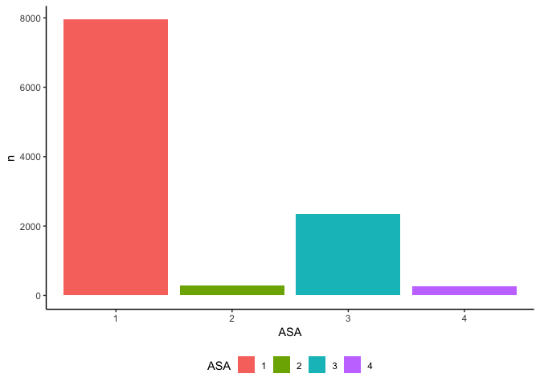
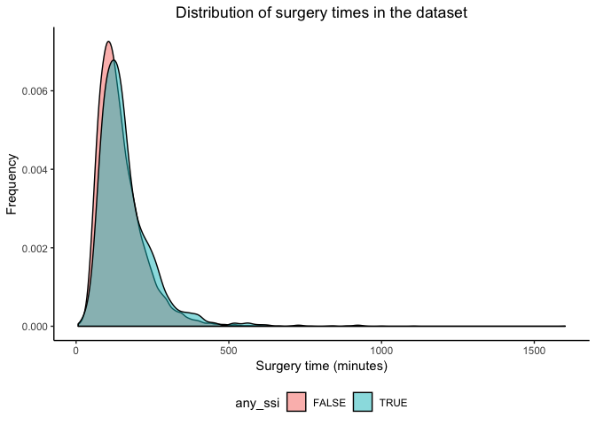

What's In A Colectomy? An Analysis
================


Table of Contents
=================

-   <a href="#intro">Introduction</a>
-   <a href="#characterize">Data Characterization</a>
-   <a href="#tidying">Tidying The Data</a>
-   <a href="#lit">Literature Review</a>
-   <a href="#sub">Subanalyses</a>
-   <a href="#regress">Regression Analysis</a>
-   <a href="#conclusion">Conclusion</a>
-   <a href="#refs">References</a>

------------------------------------------------------------------------

### Authors

-   Christian Pascual (UNI: cbp2128)
-   Justin Hsie (UNI: jih2119)
-   Tiffany Tu (UNI: tt2714)
-   Xiao Shi (UNI: xs:2330)

<h1 id="intro">
Introduction
</h1>
Colectomies are surgical procedures that remove all of part of your large intestine. These surgeries are performed for various reasons, ranging from bowel obstruction to colon cancer to just being preventative. Over 250,000 colectomies are performed each year in the United States alone, representing an estimated 10% of the total volume of general surgeries. Given the prolific nature of the surgery, the rate of post-operation complication is astounding: the average rate of complication approached 30% in the last 10 years<sup>[1](https://www.medscape.org/viewarticle/711126)</sup>.

Project Motivation
------------------

Given this, we wanted to investigate what factors contributed to increasing or decreasing the risk of post-operative complication. We have a dataset on colectomies performed from 2014 - 2016 from multiple hospitals in Michigan. Each row in the dataset represents a single colectomy and a multitude of other information concerning the surgery and the patient. Using this data, we plan to do a regression analysis to figure out which variables have an impact on affecting post-surgery complication.

<h1 id="characterize">
Data Characterization
</h1>
Before anything else, we need to bring in the data and our toolkit for analyzing the data. In addition to `tidyverse`, we've created a set of helper functions and variables that we've stored in `utils.R` to save coding space. Our data will be stored in the `colectomies` variable.

``` r
library(tidyverse)
library(haven)
source("./utils.R")

# Formatting plot output
knitr::opts_chunk$set(
  out.width = "90%"
)

# Set the plot design
theme_set(theme_classic() + 
            theme(legend.position = "bottom", 
                  plot.title = element_text(hjust = 0.5)))

# Raw data
colectomies = read_dta(file = './colectomy_raw_new.dta') 
```

Before we start our analyses, it's important for us to understand our data in its original form. In its raw form, the data has 10868 rows and 992 columns. Each row in this dataset corresponds to a single colectomy with an incredible amount of information associated with it. The data has already been purged of identifiable personal information, leaving us with a bevy of laboratory, disease, surgery and patient data.

That being said, many of the columns are useless for our analysis. Many columns contain mostly or only missing data, denoted by either blank cells or `NA` strings. Before we can start the variable selection for our model, we need to tidy up the dataset.

<h1 id="tidying">
Tidying the Data
</h1>
Data Reduction & Cleaning
-------------------------

To start the cleaning, we want to remove all columns that contain more than 50% missing values (either blank cells or `NA`). Furthermore, some of the columns actually contain duplicate information from others. These duplicate columns start with `flg` or `e`.

``` r
tidy_colectomies = colectomies %>% 
  select(-starts_with("flg_"), -starts_with("e_")) %>% 
  select_if(unlist(map(., is_mostly_intact), use.names = FALSE)) %>% 
  prettify_names(.) 
```

Our function, `is_mostly_intact`, helps us identify columns that are more than 50% missing or blank. `prettify_names` helps us mass-change the column names in the dataset in a succinct way, leaving variables that are more informative to code with. After this purge, our reduced dataset now stands at 10868 rows and 233 columns.

Data Cleaning
-------------

Many of the columns in the data appear to be numerical, but are in fact, categorical. We've created a function `catfactory` in `utils.R` to contain all the particular details on which variables needed coercing.

In our dataset, the outcome of interest we'll be focusing on is surgical site infection (SSI). We believe that focusing on this aspect of post-operation allows us to narrow down the scope of our analysis, while allowing for the greatest breadth for defining "complication". Surgical site infection (SSI) is actually contained in 3 particular columns (`postop_ssi_super`, `postop_ssi_deep` and `postop_ssi_organspace`) in the dataset, which we'll compile into one summary variable `any_ssi`.

``` r
tidy_colectomies = tidy_colectomies %>%
  catfactory(.) %>% 
  mutate(any_ssi = (postop_ssi_super + postop_ssi_deep +    postop_ssi_organspace) >= 1)
```

Even with all of the data reduction, there are still too many variables to know which to include in the regression. In aid in variable selection, we did a literature review to see what has relationships have been established.

<h1 id="lit">
Literature Review: Relevant Factors
</h1>
Thankfully, several factors have been identified as risk factors for complications in colorectal surgery. Kirchoff established many risk factors in a 2010 paper on the subject. The paper found that age, gender, prior surgery, obesity, nutritional status and body weight loss were patient-related factors. Factors that were related to the surgery itself included: open access to abdominal cavity, blood loss, surgical approach switches and length of operating time<sup>[2](https://www.ncbi.nlm.nih.gov/pubmed/27765178)</sup>.

Ko et. al found that certain diseases were associated with increased risk of death post-colectomy, including venous thromboembolism (VTE), sepsis, acute myocardial infarction, pneumonia, respiratory failure and shock<sup>[3](https://www.ncbi.nlm.nih.gov/pubmed/27765178)</sup>.

In another paper, Tang et. al focuses on risk factors associated with surgical site infection, our outcome of interest. Dr. Tang identified ASA score, blood transfusion, drainage use, and sex<sup>[4](https://www.ncbi.nlm.nih.gov/pmc/articles/PMC1422004)</sup>.

With these papers in mind, we know that it would be useful to try to include these in our analyses should these data points appear in the dataset. We selected a few of these variables and others to explore more in our subanalyses below.

<h1 id="sub">
Subanalyses
</h1>
### Is there a relationship between SSI and insurance status?

For this analysis, we wanted to see how SSI was related with insurance staus. We believed that patients with little to no coverage would be forced to go to less experienced hospitals and experience more SSI.

``` r
insurance_df = tidy_colectomies %>% 
  select(., any_ssi, insurance_payment_type) %>% 
  mutate(insurance_payment_type = as.factor(insurance_payment_type)) %>% 
  filter(!is.na(insurance_payment_type)) %>% 
  group_by(insurance_payment_type) %>% 
  summarize(n = n(),
            total_SSI = sum(any_ssi),
            percent_SSI = total_SSI / n)

knitr::kable(insurance_df)
```

| insurance\_payment\_type |     n|  total\_SSI|  percent\_SSI|
|:-------------------------|-----:|-----------:|-------------:|
| 1                        |  3007|         244|     0.0811440|
| 2                        |  2229|         185|     0.0829969|
| 3                        |   533|          65|     0.1219512|
| 4                        |   444|          49|     0.1103604|
| 5                        |  1791|         142|     0.0792853|
| 6                        |    17|           4|     0.2352941|
| 7                        |     2|           0|     0.0000000|
| 8                        |   136|          15|     0.1102941|
| 9                        |  2252|         198|     0.0879218|
| 10                       |   372|          23|     0.0618280|
| 11                       |    72|          10|     0.1388889|

We can see in the table that insurance types are not evenly distributed over the data. Thus, we need to compare percentages of colectomies that resulted in SSI instead of raw counts.

``` r
ggplot(data = insurance_df,
       aes(x = insurance_payment_type,
           y = percent_SSI,
           fill = insurance_payment_type)) +
  geom_bar(stat = "identity") +
  labs(
    x = "Insurance Payment Type",
    y = "Percent of colecotmies resulting in SSI",
    title = "Insurance Types and SSI"
  ) + 
  theme(legend.position = "none")
```



The insurance payment types are as follows:
1. Medicare
2. Medicare + Medicare Supplemental Plan/Medigap Insurance
3. Medicaid
4. Medicare AND Medicaid
5. Blue Cross Blue Shield of Michigan (BCBSM)
6. Private Insurance, incl. HMO plans
7. Other
8. Self-Pay
9. Uninsured
10. International Patient
11. Medicare Advantage - Blue Cross Blue Shield of Michigan

In the first table, we can see that the most occurences of SSIs are in patients with Medicare, Medicare + Medicare Supplemental Plan/Medigap Insurance, or those who are uninsured. However, those variables also had the greatest number of patients, so we can't solely rely on the absolute SSI counts to tell us anything useful. We must look at the percentages instead.

In the second plot, we can see the percentage of SSI occurences out of the total number of colectomies performed based on insurance type. There is generally no distinction between the insurance types, with most of the percentages hovering between 6 to 12 percent. Noticeably, patients with private insurance had a much higher percentage of SSIs at above 25 percent while patients with other insurance had 0 percent. However, this is most likely due to the small sample size of patients with those types of insurance and should not affect our conclusions.

In the end, it seems that there is no relationship between insurance type and occurence of SSIs.

### How are SSI distributed in patients with different diseases and prior conditions? (Tiffany's Analysis)

### How are SSI associated with ASA level?

Tang pointed out that ASA is related to SSI, so we investigate that trend in our data here.

``` r
asa_analysis = tidy_colectomies %>% 
  select(any_ssi, asa_class_id, postop_ssi_super, postop_ssi_deep, postop_ssi_organspace) %>% 
  mutate(ssi_type = ifelse(
           postop_ssi_super == 1, "Super",
           ifelse(postop_ssi_deep == 1, "Deep", 
                  ifelse(postop_ssi_organspace == 1, "OrganSpace", "None")
         ))) %>%
  rename(., ASA = asa_class_id) %>% 
  filter(!is.na(ASA)) %>% 
  group_by(ASA) %>% 
  summarize(n = n(), 
            n_SSIs = sum(any_ssi),
            percent_SSIs = n_SSIs/n)

knitr::kable(asa_analysis)
```

| ASA |     n|  n\_SSIs|  percent\_SSIs|
|:----|-----:|--------:|--------------:|
| 1   |  7947|      616|      0.0775135|
| 2   |   297|       33|      0.1111111|
| 3   |  2341|      246|      0.1050833|
| 4   |   272|       41|      0.1507353|

``` r
ggplot(data = asa_analysis, aes(x = ASA, y = n, fill = ASA)) +
  geom_bar(stat = "identity")
```



The majority of cases are class 1, the least severe. The second most common is level 3, indicating that there are generally benign colectomies with a handful that are more serious. Now, we'll look at how SSIs occur as a function of ASA level.

``` r
ggplot(data = asa_analysis, aes(x = ASA, y = percent_SSIs, fill = ASA)) +
  geom_bar(stat = "identity")
```



We see that there is also an increasing trend in surgical site infections as the ASA severity gets higher. Thus, we've shown that as a colectomy's severity increases, the patient is slightly more likely to get an infection after their surgery.

<h1 id="regress">
Regression Analysis
</h1>
<h1 id="conclusion">
Conclusion
</h1>
<h1 id="refs">
References
</h1>
1.  <https://www.medscape.org/viewarticle/711126>
2.  <https://www.ncbi.nlm.nih.gov/pmc/articles/PMC2852382>
3.  <https://www.ncbi.nlm.nih.gov/pubmed/27765178>
4.  <https://www.ncbi.nlm.nih.gov/pmc/articles/PMC1422004>
