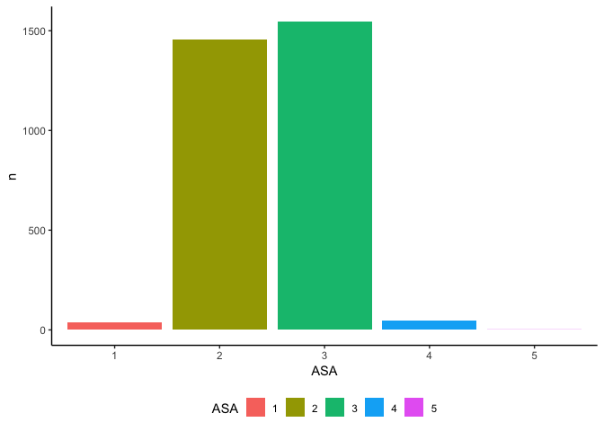
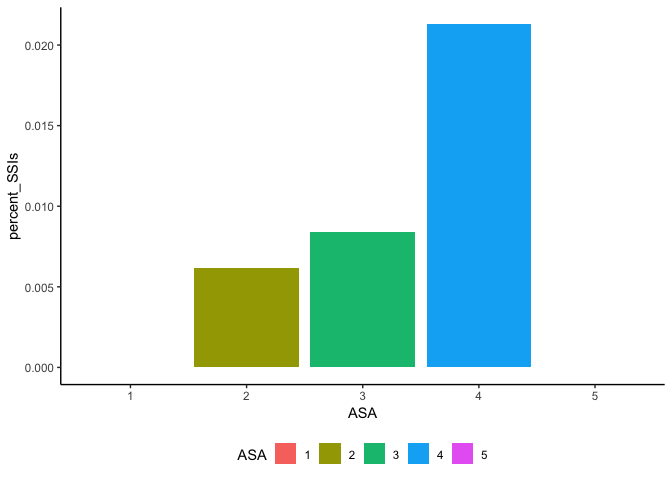
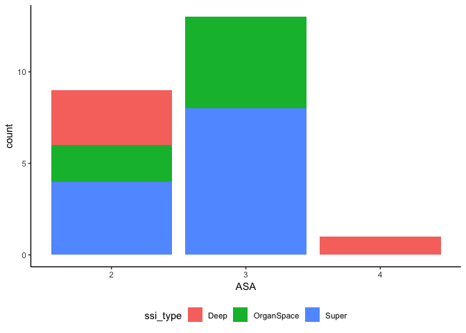

cbp\_subanalysis
================
Christian Pascual
11/23/2018

``` r
# Our data analysis toolkit
library(tidyverse)

# Formatting plot output
knitr::opts_chunk$set(
  out.width = "90%"
)

# Set the plot design
theme_set(theme_classic() + 
            theme(legend.position = "bottom", 
                  plot.title = element_text(hjust = 0.5)))

colectomies = read.csv(file = './procedure10.csv') 

tidy_colectomies = colectomies %>% 
  select(-contains("flg_"), -contains("e_")) %>%
  select_if(colSums(is.na(.)) < nrow(.) * 0.5)
```

How are successes associated with ASA level?
============================================

Important information

-   Covariate: asa\_class\_id
-   Outcome: postop\_ssi\_super
-   Outcome: postop\_ssi\_deep
-   Outcome: postop\_ssi\_organspace

``` r
asa_analysis = tidy_colectomies %>% 
  select(asa_class_id, postop_ssi_super, postop_ssi_deep, postop_ssi_organspace) %>% 
  mutate(any_ssi = postop_ssi_super + postop_ssi_deep + postop_ssi_organspace,
         had_ssi = any_ssi > 0,
         asa_class_id = as.factor(asa_class_id),
         ssi_type = ifelse(
           postop_ssi_super == 1, "Super",
           ifelse(postop_ssi_deep == 1, "Deep", 
                  ifelse(postop_ssi_organspace == 1, "OrganSpace", "None")
         ))) %>%
  rename(., ASA = asa_class_id) %>% 
  group_by(ASA) %>% 
  summarize(n = n(), 
            n_SSIs = sum(had_ssi),
            percent_SSIs = n_SSIs/n)

knitr::kable(asa_analysis)
```

| ASA |     n|  n\_SSIs|  percent\_SSIs|
|:----|-----:|--------:|--------------:|
| 1   |    38|        0|      0.0000000|
| 2   |  1454|        9|      0.0061898|
| 3   |  1544|       13|      0.0084197|
| 4   |    47|        1|      0.0212766|
| 5   |     1|        0|      0.0000000|

Now plotting out this analysis:

``` r
ggplot(data = asa_analysis, aes(x = ASA, y = n, fill = ASA)) +
  geom_bar(stat = "identity")
```



The majority of colectomy surgeries are classified as 2 or 3.

``` r
ggplot(data = asa_analysis, aes(x = ASA, y = percent_SSIs, fill = ASA)) +
  geom_bar(stat = "identity")
```



However, we see that there is also an increasing trend in surgical site infections as the ASA severity gets higher.

``` r
asa_analysis2 = tidy_colectomies %>% 
  select(asa_class_id, postop_ssi_super, postop_ssi_deep, postop_ssi_organspace) %>% 
  mutate(any_ssi = postop_ssi_super + postop_ssi_deep + postop_ssi_organspace,
         had_ssi = any_ssi > 0,
         asa_class_id = as.factor(asa_class_id),
         ssi_type = ifelse(
           postop_ssi_super == 1, "Super",
           ifelse(postop_ssi_deep == 1, "Deep", 
                  ifelse(postop_ssi_organspace == 1, "OrganSpace", "None")
         ))) %>%
  rename(., ASA = asa_class_id) %>% 
  filter(ssi_type != "None")

ggplot(data = asa_analysis2, aes(x = ASA, fill = ssi_type)) +
  geom_bar()
```



Just looking at the instances of SSI, we see that there's not really a discernable pattern in how the types of SSI are distributed by ASA type.
