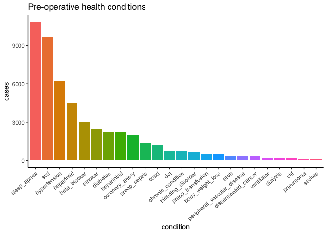
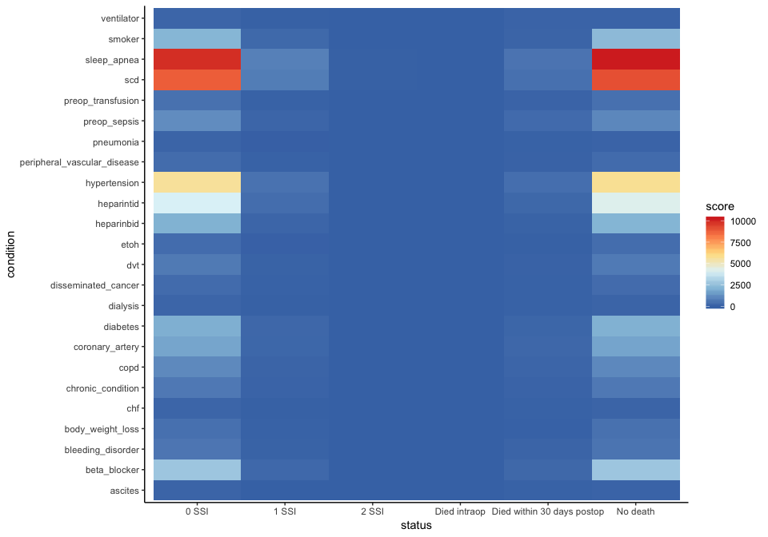

tiff\_subanalysis
================
Tiffany Tu
11/25/2018

### How are successes distributed by patients with different diseases and prior conditions?

-   Success can be measured by Surgical Site Infection (SSI) levels
-   postop\_ssi\_super
-   postop\_ssi\_deep
-   postop\_ssi\_organspace

-   Pre-operative health condition descriptions
-   Smoker: Tobacco use within 1 year
-   Etoh: &gt;2 drinks/day two weeks prior to surgery
-   Body Weight Loss: 10% of body weight loss 6 months prior to surgery
-   Chf: Congestive Heart Failure within 30 days prior to surgery
-   Scd : Specific Carbohydrate Diet
-   Copd: Chronic Obstructive Pulmonary Disease
-   Dvt: Deep Vein Thrombosis
-   Chronic Condition: steriods, immunosuppresive meds
-   Preop-transfusion: RBCs within 72 hours of surgery
-   Ventilator: ventilator dependent

There are three levels of severity for variables sleep apnea and diabetes. All variables are converted to binary for this analysis and NA entries are set to 0, indicating that the patient does not have this condition.

#### Understanding our dataset

``` r
healthdisease %>% group_by(any_ssi) %>% 
  summarize(n = n()) %>% kable()
```

|  any\_ssi|     n|
|---------:|-----:|
|         0|  9931|
|         1|   910|
|         2|    27|

We'll take a look at the number of cases for each health condition available in our dataset.

``` r
dist_data = healthdisease %>% 
  select(-any_ssi, -death) %>% 
  gather(condition, key) %>% 
  filter(key > 0) %>% 
  group_by(condition) %>% 
  summarize(cases = n()) %>% 
  mutate(condition = reorder(condition, -cases))

ggplot(dist_data, aes(x = condition, y = cases, fill = condition)) +
  geom_bar(stat = "identity") + ggtitle("Pre-operative health conditions") +
  theme_classic() + theme(axis.text.x = element_text(angle = 40, hjust = 1), legend.position = "none") 
```



#### SSI and death association to each health condition

Comparing number of death and SSI cases side by side with each health condition, we see a nearly symmetric heatmap. There are fewer cases under patients that actually got SSI or died from the operation, so it is difficult to conclude any direct relationship between health condition and surgery outcome. We can see that there are a great number of successful cases for patients with sleep apnea, specific carbohydrate diet, and hypertension.

``` r
heatplot = healthdisease %>% 
  mutate(death = recode(death, `3` = "No death", `1` = "Died intraop", 
                        `2` = "Died within 30 days postop"),
         any_ssi = recode(any_ssi, `0` = "0 SSI", `1` = "1 SSI", `2` = "2 SSI")) %>%
  na.omit() %>% 
  gather(condition, score, -death, -any_ssi) %>%
  gather(key, status, -condition, -score) %>% 
  select(-key) %>% group_by(status, condition) %>% 
  summarise(score = sum(score)) 

ggplot(heatplot, mapping = aes(x = status, y = condition, fill = score)) + 
  geom_tile() + scale_fill_distiller(palette = "RdYlBu") + theme_classic()
```



We can't make any conclusions regarding sugery success in relation to pre-operation health conditions because there are only few cases of SSI &gt; 0 as well as the number of death occurence. It is clear that the greater number of pre-operative health condition a patient has, the more likely it is for SSI to occur.
