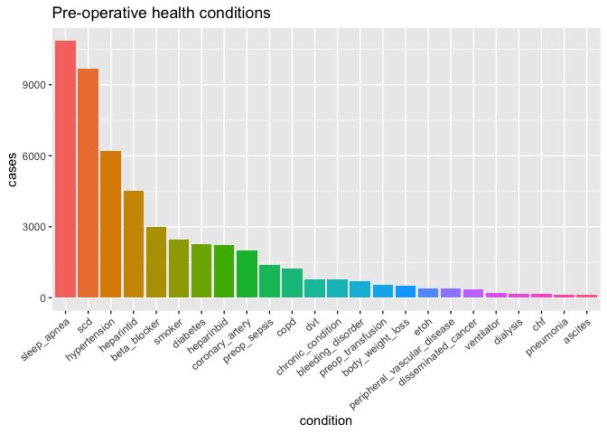
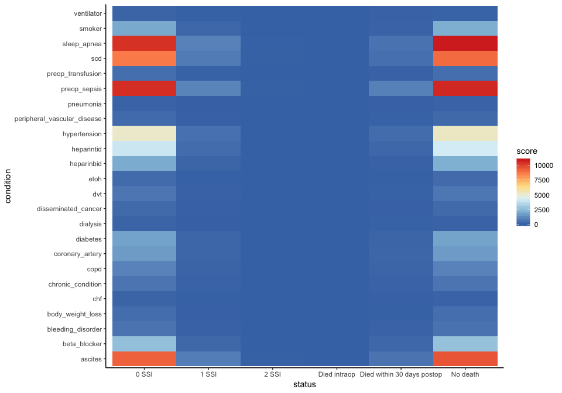
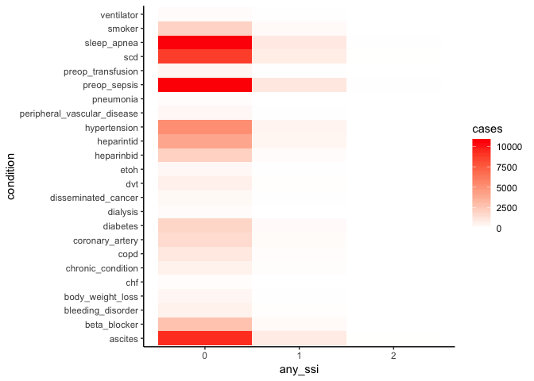
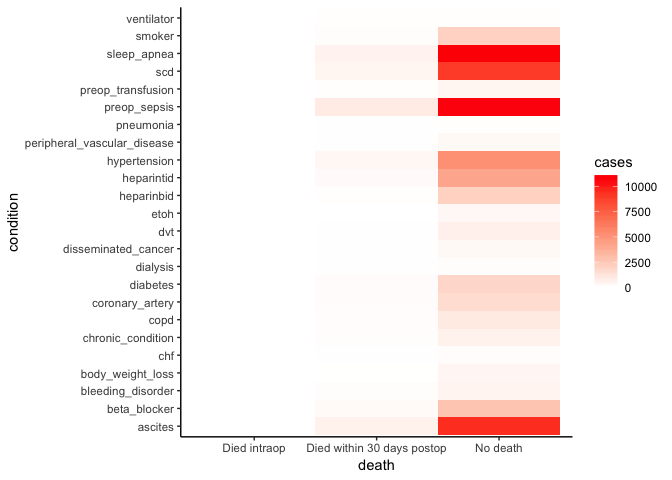

tiff\_subanalysis
================
Tiffany Tu
11/25/2018

## How are successes distributed by patients with different diseases and prior conditions?

  - Success can be measured by Surgical Site Infection (SSI) levels
      - postop\_ssi\_super  
      - postop\_ssi\_deep
      - postop\_ssi\_organspace
  - Pre-operative health condition descriptions
      - Smoker: Tobacco use within 1 year
      - Etoh: \>2 drinks/day two weeks prior to surgery
      - Body Weight Loss: 10% of body weight loss 6 months prior to
        surgery
      - Chf: Congestive Heart Failure within 30 days prior to surgery
      - Scd : Specific Carbohydrate Diet
      - Copd: Chronic Obstructive Pulmonary Disease
      - Dvt: Deep Vein Thrombosis
      - Chronic Condition: steriods, immunosuppresive meds
      - Preop-transfusion: RBCs within 72 hours of surgery
      - Ventilator: ventilator dependent

There are three levels of severity for variables sleep apnea and
diabetes. All variables are converted to binary for this analysis and NA
entries are set to 0, indicating that the patient does not have this
condition.

### Understanding our dataset

We’ll take a look at the number of cases for each health condition
available in our dataset as well as the number of death and SSI levels.

``` r
dist_healthdisease = healthdisease %>% 
  select(-postop_ssi_super, -postop_ssi_deep, -postop_ssi_organspace, 
         -any_ssi, -death, -surgical_approach) %>% 
  mutate(ascites = ifelse(ascites == 2, 1, 0),
         preop_sepsis = ifelse(preop_sepsis == 1, 0, 1), 
         sleep_apnea = ifelse(sleep_apnea == 0, 0, 1)) %>%
  replace_na(list(dvt = 0, disseminated_cancer = 0, beta_blocker = 0, scd = 0,
                  heparinbid = 0, heparintid = 0)) %>% 
  rownames_to_column %>% 
  gather(condition, value, -rowname) %>% 
  spread(rowname, value) %>% 
  mutate(cases = rowSums(.[2:10868])) %>% 
  transform(condition = reorder(condition, -cases))

ggplot(dist_healthdisease, aes(x = condition, y = cases, fill = condition)) +
  geom_bar(stat = "identity") + ggtitle("Pre-operative health conditions") +
  theme_classic() + theme(axis.text.x = element_text(angle = 40, hjust = 1), legend.position="none")
```

<!-- -->

``` r
deathsum = healthdisease %>% group_by(death) %>% summarize(n = n()) %>% 
  mutate(death = c("Died intraop", "Died within 30 days postop", 
                   "No death", "NA"),
         death = factor(death, levels = c("Died intraop", 
                                          "Died within 30 days postop", "No death", "NA")))
  
deathplot = ggplot(deathsum, aes(x = death, y = n, fill = death)) + geom_bar(stat = "identity") + guides(fill = FALSE) + labs(y = "") + theme_classic() 
```

``` r
SSIsum = healthdisease %>% group_by(any_ssi) %>% summarize(n = n()) %>% 
  mutate(any_ssi = as.factor(any_ssi))

SSIplot = ggplot(SSIsum, aes(x = any_ssi, y = n, fill = any_ssi)) + geom_bar(stat = "identity") + guides(fill = FALSE) + labs(y = "") + theme_classic() 
```

``` r
grid.arrange(deathplot, SSIplot, top = "Death and SSI distribution", left = "n")
```

<!-- -->

### SSI level and health condition association

``` r
heatplot1 = healthdisease %>% 
  select(-postop_ssi_super, -postop_ssi_deep, -postop_ssi_organspace, -death,
         -surgical_approach) %>% 
  na.omit() %>% 
  gather(condition, score, -any_ssi) %>% 
  group_by(any_ssi, condition) %>% 
  summarise(score = sum(score))

ggplot(heatplot1, mapping = aes(x = any_ssi, y = condition, fill = score)) + 
  geom_tile() + scale_fill_gradient2('cases', low = "blue", mid = "white", 
                                     high = "red", midpoint = 0) + theme_classic() 
```

<!-- -->

### Death and health condition association

``` r
heatplot2 = healthdisease %>% 
  select(-postop_ssi_super, -postop_ssi_deep, -postop_ssi_organspace, 
         -any_ssi, -surgical_approach) %>%
  mutate(death = recode(death, `1` = "Died intraop", `2` = "Died within 30 days postop", 
                   `3` = "No death")) %>% na.omit() %>% 
  gather(condition, score, -death) %>% group_by(death, condition) %>% 
  summarise(score = sum(score)) 

ggplot(heatplot2, mapping = aes(x = death, y = condition, fill = score)) + 
  geom_tile() + scale_fill_gradient2('cases', low = "blue", mid = "white",
                                     high = "red", midpoint = 0) + theme_classic() 
```

<!-- -->
